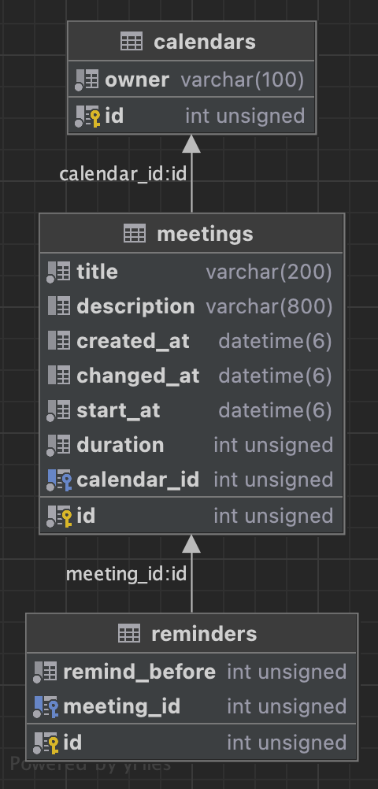

### Reverse engineering with Entity Framework Core - integration of an existing relational database system

Not all development projects start from scratch. If you need to integrate an existing relational database system into your [.NET](https://docs.microsoft.com/en-us/dotnet/) software application, then [Entity Framework Core](https://docs.microsoft.com/en-us/ef/) (hereafter EF Core) provides you with a useful tool to master the required [Database-First Approach](https://www.entityframeworktutorial.net/entityframework6/introduction.aspx).

This blog post will show you how EF Core [CLI](https://en.wikipedia.org/wiki/Command-line_interface) can simplify the reverse engineering of an existing relational database system and dramatically speed up integration into your software application. EF Core is currently the most popular [ORM](https://en.wikipedia.org/wiki/Object%E2%80%93relational_mapping) framework for Microsoft .NET.

#### **Advantages**
You have the following advantages:
* You will quickly arrive at an object-oriented database model for your .NET software application.
* EF Core provides automatic code generation of entity classes (models) and the DbContext class (connection to the database).
* By using `partial` classes and `virtual` properties the generated code is flexibly extendable by own logic.
* EF Core supports LINQ queries and change tracking of your records, among other things.

#### **Relational reference database**
The following entity relationship diagram shows the structure of the reference database used in the following.

<p align="center">
    
</p>

The database shown could be the basis of a calendar application in which a user can manage appointments in his calendar and then provide them with reminders. The tables are connected by a 1:N relation. You can create the reference database using the DDL script [`db_server_conf.sql`](https://github.com/djek-sweng/blog-scaffold-dbcontext-efcore/blob/main/tools/mysql/init/db_server_conf.sql).

#### **Getting started**
Provided you have [Docker](https://www.docker.com/) installed on your machine, you can run the reference database on a [MySQL](https://www.mysql.com/) server inside a Docker container. To do this, simply start the Docker Engine and then run the shell script [`run_mysql_server.sh`](https://github.com/djek-sweng/blog-scaffold-dbcontext-efcore/blob/main/run_mysql_server.sh).

You can then use the following connection string to connect your applications to the database:

```txt
Server=localhost; Port=4200; Username=root; Password=pasSworD; Database=db_scaffold_efcore;
```

If you have installed a MySQL database server on your computer, then you can also use this. But make sure that you have an appropriate configuration.

#### **Create and set up project for code generation**
At the beginning you have to install EF Core once on your computer.

```sh
#!/bin/sh

dotnet tool install --global dotnet-ef
```

For the reference database EF Core can now generate the appropriate code. To do this, you create a `classlib` project in advance and then add the necessary packages.

```sh
#!/bin/sh

LIB="Scaffold.Library"

# Create project.
dotnet new classlib -n "$LIB"

# Add required packages.
cd "$LIB"
dotnet add package Microsoft.EntityFrameworkCore
dotnet add package Microsoft.EntityFrameworkCore.Design
dotnet add package Microsoft.EntityFrameworkCore.Relational
dotnet add package Pomelo.EntityFrameworkCore.MySql
```

The packages give you access to the EF Core base and design-time components. Furthermore, components for the integration of relational databases, as well as Pomelo's MySQL database provider are available for EF Core.

#### **Create shell script for code generation**
In the next step, you create a shell script that you can use for automatic code generation of the entity classes and the DbContext class.

The following code block shows you an example of the options available for configuring the code generator and how it is started. The project can be compiled directly after code generation.

```sh
#!/bin/sh

# File: ef_dbcontext_scaffold.sh

# Configure code generator (required).
CONNECTION="Server=localhost; Port=4200; Username=root; Password=pasSworD; Database=db_scaffold_efcore;"
PROVIDER="Pomelo.EntityFrameworkCore.MySql"

# Configure code generator (optional).
CONTEXT="DatabaseContext"
CONTEXT_DIR="./Data/Generated"
CONTEXT_NAMESPACE="Scaffold.Library.Data"
OUTPUT_DIR="./Models/Generated"
NAMESPACE="Scaffold.Library.Models"

# Start code generation.
dotnet ef dbcontext scaffold "$CONNECTION" "$PROVIDER" \
  --context "$CONTEXT" \
  --context-dir "$CONTEXT_DIR" \
  --context-namespace "$CONTEXT_NAMESPACE" \
  --output-dir "$OUTPUT_DIR" \
  --namespace "$NAMESPACE" \
  --force

# Build project.
dotnet build
```

The specification of the database connection `$CONNECTION` and the database provider `$PROVIDER` are mandatory. All other specifications are optional and freely configurable according to your requirements.

The following table describes the options shown. Additional options are documented on the [Microsoft Docs](https://docs.microsoft.com/en-us/ef/core/cli/dotnet#common-options) website.

| Option              | Description                                                           |
|:--------------------|:----------------------------------------------------------------------|
| --context           | Name of the DbContext class.                                          |
| --context-dir       | Directory of the DbContext class (relative to the project directory). |
| --context-namespace | Namespace of the DbContext class.                                     |
| --output-dir        | Directory of the entity classes (relative to the project directory).  |
| --namespace         | Namespace of the entity classes.                                      |
| --force             | Forces overwriting of existing files.                                 |

#### **Analysis of the generated code**
Following the code generation, we analyze the entity class `Meeting` as an example, see the following code block. 

```csharp
// Generated file: Meeting.cs

using System;
using System.Collections.Generic;

namespace Scaffold.Library.Models
{
    public partial class Meeting
    {
        public Meeting()
        {
            Reminders = new HashSet<Reminder>();
        }

        public uint Id { get; set; }
        public string Title { get; set; } = null!;
        public string? Description { get; set; }
        public DateTime? CreatedAt { get; set; }
        public DateTime? ChangedAt { get; set; }
        public DateTime StartAt { get; set; }
        public uint Duration { get; set; }
        public uint CalendarId { get; set; }

        public virtual Calendar Calendar { get; set; } = null!;
        public virtual ICollection<Reminder> Reminders { get; set; }
    }
}
```

The namespace matches the configuration. The entity class `Meeting` is `partial` and has a `public` constructor that initializes the navigation property `Reminders`. Furthermore, the entity class has auto-implemented `public` property accessors. Optional fields or fields automatically set by the database correspond to nullable properties, e.g. `Description` or `CreatedAt`. The navigation properties `Calendar` and `Reminders` are `virtual`. Furthermore the code generator converts the SQL conform snake case notation `changed_at` into .NET conform pascal case notation `ChangedAt`.

You can also find the complete generated code in the [GitHub repository](https://github.com/djek-sweng/blog-scaffold-dbcontext-efcore/blob/main/src/Scaffold.Library).

#### **Flexible enhancement of the generated code**
Due to the `partial` modifiers all generated classes are flexibly extendable by own code. So you can easily extend the entity class `Meeting` with your own methods and implement them in a separate file. When code is generated again, your own code is not lost.

The following code block shows a factory method `Create()` that can create new instances. The method `IsStartInFuture()` can determine if the start time `StartAt` of a `Meeting` is in the future.

```csharp
// File: Meeting.cs

using System;

namespace Scaffold.Library.Models;

public partial class Meeting
{
    public static Meeting Create(
        string title,
        string? description,
        uint duration,
        DateTime startAt,
        uint calendarId)
    {
        return new Meeting
        {
            Title = title,
            Description = description,
            Duration = duration,
            StartAt = startAt,
            CalendarId = calendarId
        };
    }

    public bool IsStartInFuture()
    {
        return StartAt > DateTime.UtcNow;
    }
}
```

If you want to use the entity class `Meeting` as parent class, then a child class derived from it can override the behavior of the auto-implemented `virtual` navigation properties `Calendar` and `Reminders`. You can find an example of this on the [Microsoft Docs](https://docs.microsoft.com/en-us/dotnet/csharp/language-reference/keywords/virtual) website.

#### **Application example (proof of concept)**
In a small sample application you show that the code from the `classlib` project created above can easily be integrated into an executable application.

To do this, you create a `console` project and then add the necessary references and packages.

```sh
#!/bin/sh

LIB="Scaffold.Library"
APP="Scaffold.App"

# Create project.
dotnet new console -n "$APP"

# Add required reference.
dotnet add "$APP"/"$APP".csproj reference "$LIB"/"$LIB".csproj

# Add required packages.
cd "$APP"
dotnet add package Microsoft.EntityFrameworkCore
dotnet add package Microsoft.EntityFrameworkCore.Relational
```

The console application in `Program.cs` could run the following method `StartMinimal()`. In this method, records for the entities `Calendar`, `Meeting` and `Reminder` are added to the database via the `DatabaseContext` used. The factory methods `Create()` and `IsStartInFuture()` implemented by us are also used here.

```csharp
// File: Demo.cs

using System;
using System.Linq;
using Scaffold.Library.Data;
using Scaffold.Library.Models;

namespace Scaffold.App;

public static class Demo
{
    public static void StartMinimal()
    {
        /*
         * Add database context into scope.
         */
        using var context = new DatabaseContext();

        /*
         * Add calendar.
         */
        var calendar = Calendar.Create(
            owner: "Arthur Dent"
        );
        context.Calendars.Add(calendar);
        context.SaveChanges();

        /*
         * Add meeting to calendar.
         */
        var meeting = Meeting.Create(
            title: "Have lunch with Zaphod Beeblebrox",
            description: "Ford's semi-half-cousin likes tea",
            duration: 42,
            startAt: DateTime.UtcNow.AddDays(10),
            calendarId: calendar.Id
        );
        context.Meetings.Add(meeting);
        context.SaveChanges();

        /*
         * Check meeting start date.
         */
        Console.WriteLine($"Does meeting '{meeting.Title}' start in future? " +
                          $"{meeting.IsStartInFuture()}.");

        /*
         * Add reminders to meeting.
         */
        context.Reminders.AddRange(
            Reminder.Create(
                remindBefore: 4,
                meetingId: meeting.Id),
            Reminder.Create(
                remindBefore: 2,
                meetingId: meeting.Id)
        );
        context.SaveChanges();
    }
}
```

If you run the application example using Docker and [`run_mysql_server.sh`](https://github.com/djek-sweng/blog-scaffold-dbcontext-efcore/blob/main/run_mysql_server.sh), then you can open the database [Adminer](https://www.adminer.org/en/) in your browser via the URL http://localhost:4300/.

You can also find the sample application shown here and another one in the [GitHub repository](https://github.com/djek-sweng/blog-scaffold-dbcontext-efcore/blob/main/src/Scaffold.App).

#### **Conclusion**
The discussed example shows you the first steps on the way to integrate an existing relational database system into your .NET software application. The main effort is to set up a suitable project structure and implement some shell scripts for automatic code generation using the EF Core CLI.

Additional steps will certainly be necessary, but the effort will be worth it. After successful integration, powerful EF Core functionalities, such as LINQ queries and change tracking of your data sets, will be available to you.

You can find the complete code in this GitHub repository.

Happy Coding!

German version

https://www.traperto.com/reverse-engineering-mit-entity-framework-core/
